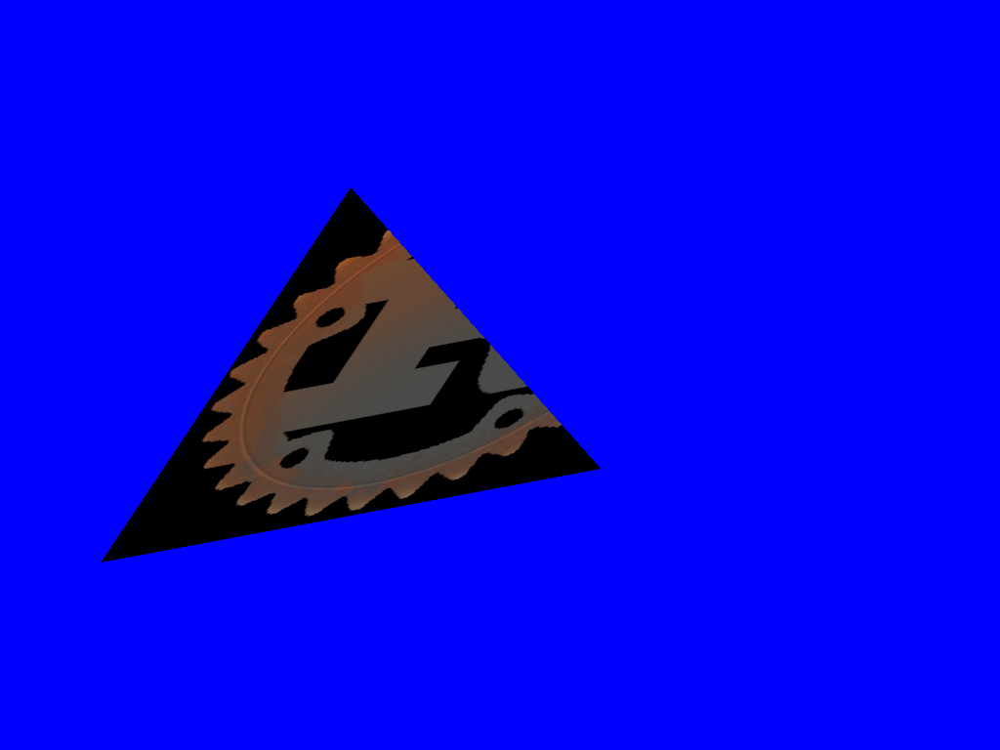

# Загрузка текстуры

Текстура - это изображение или коллекция изображений, загруженных в видеопамять.

Чтобы загрузить текстуру, мы должны сначала декодировать формат изображения, в котором хранится наше изображение (например, PNG). Для этого мы будем использовать библиотеку `image`. Давайте добавим его в файл Cargo.toml:

```toml
[dependencies]
image = "*"
```

И добавим в верх нашего файла:

```rust
extern crate image;
```

Чтобы загрузить изображение, нам просто нужно использовать `image::load`:

```rust
use std::io::Cursor;
let image = image::load(Cursor::new(&include_bytes!("/path/to/image.png")[..]),
                        image::PNG).unwrap().to_rgba();
let image_dimensions = image.dimensions();
let image = glium::texture::RawImage2d::from_raw_rgba_reversed(&image.into_raw(), image_dimensions);
```

Загрузить изображение в виде текстуры так же просто:

```rust
let texture = glium::texture::Texture2d::new(&display, image).unwrap();
```

# Использование текстуры

В OpenGL нет автоматического способа отображения текстуры поверх фигуры. Как и любые другие методы рендеринга, это должно быть сделано вручную. Это означает, что мы должны вручную загрузить значения цвета из нашей текстуры и вернуть их с помощью нашего фрагментного шейдера.

Для этого сначала нужно немного изменить нашу форму, чтобы указать, к какому расположению текстуры прикреплена каждая вершина:

```rust
#[derive(Copy, Clone)]
struct Vertex {
    position: [f32; 2],
    tex_coords: [f32; 2],       // <- это новое
}

implement_vertex!(Vertex, position, tex_coords);        // не забудьте добавить `tex_coords` сюда

let vertex1 = Vertex { position: [-0.5, -0.5], tex_coords: [0.0, 0.0] };
let vertex2 = Vertex { position: [ 0.0,  0.5], tex_coords: [0.0, 1.0] };
let vertex3 = Vertex { position: [ 0.5, -0.25], tex_coords: [1.0, 0.0] };
let shape = vec![vertex1, vertex2, vertex3];
```

Координаты текстур находятся в диапазоне от `0.0` до `1.0`. Координаты `(0.0, 0.0)` соответствуют нижнему левому углу текстуры, а `(1.0, 1.0)` верхнему правому углу.

Этот новый атрибут `tex_coords` будет передан вершинному шейдеру, как и `position`. Мы не имеем к этому никакого отношения, и мы просто собираемся передать его фрагментному шейдеру:

```glsl
#version 140

in vec2 position;
in vec2 tex_coords;
out vec2 v_tex_coords;

uniform mat4 matrix;

void main() {
    v_tex_coords = tex_coords;
    gl_Position = matrix * vec4(position, 0.0, 1.0);
}
```

Аналогично переменной `my_attr` значение `v_tex_coords` будет интерполировано, так что каждый пиксель получит значение, соответствующее его позиции. Это значение соответствует координатам в текстуре, к которой прикреплен этот пиксель.

Все, что осталось сделать в нашем фрагментном шейдере, это получить значение цвета по этим координатам в текстуре с помощью функции `texture()`, предоставляемой OpenGL.

```glsl
#version 140

in vec2 v_tex_coords;
out vec4 color;

uniform sampler2D tex;

void main() {
    color = texture(tex, v_tex_coords);
}
```

Как вы можете видеть, текстура - это `uniform` типа `sampler2D`. Существует много типов текстур и текстурных форм, и `sampler2D` соответствует простой двумерной текстуре.

Поскольку текстура является униформой, мы должны передать ссылку на нее при рисовании в коде Rust:

```rust
let uniforms = uniform! {
    matrix: [
        [1.0, 0.0, 0.0, 0.0],
        [0.0, 1.0, 0.0, 0.0],
        [0.0, 0.0, 1.0, 0.0],
        [ t , 0.0, 0.0, 1.0f32],
    ],
    tex: &texture,
};
```

И вот результат:



**[Вы можете найти весь исходный код здесь](https://github.com/glium/glium/blob/master/examples/tutorial-06.rs).**
