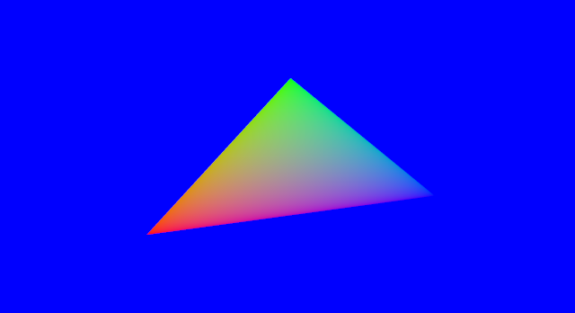

# Attributes

In our programming pipeline, the color of each pixel inside the triangle corresponds to the output of our fragment shader. Since our fragment shader returns `(1.0, 0.0, 0.0, 1.0)`, each pixel is an opaque red (the four values correspond to: red, green, blue, alpha/opacity).

In this example we'll be adding another attribute allowing us to specify a color for each corner of the triangle. To accomplish this we'll first have to extend our `Vertex` struct and shape as follows:

```rust
#[derive(Copy, Clone)]
struct Vertex {
    position: [f32; 2],
    color: [f32; 3],
}
implement_vertex!(Vertex, position, color);

let shape = vec![
    Vertex { position: [-0.5, -0.5], color: [1.0, 0.0, 0.0] },
    Vertex { position: [ 0.0,  0.5], color: [0.0, 1.0, 0.0] },
    Vertex { position: [ 0.5, -0.25], color: [0.0, 0.0, 1.0] }
];
```

Here we've added a color attribute of type `[f32; 3]` which corresponds to a `vec3` in GLSL, storing the red, green and blue components. In our shape we've specified a solid red, green and blue for each corner. Now we need to update the shaders so that they make us of this new attribute, first the vertex shader:

```glsl
#version 140

in vec2 position;
in vec3 color;      // our new attribute
out vec3 vertex_color;

uniform mat4 matrix;

void main() {
    vertex_color = color; // we need to set the value of each `out` variable.
    gl_Position = matrix * vec4(position, 0.0, 1.0);
}
```

The `in vec3 color;` line should look familiar to you, what is new however is the following line: `out vec3 vertex_color;`.
This line defines a variable that is going to be passed along to the fragment shader, let's update our fragment shader to make use of it and then explore what's going on:

```glsl
#version 140

in vec3 vertex_color;
out vec4 color;

void main() {
    color = vec4(vertex_color, 1.0);   // We need an alpha value as well
}
```

Let's see what happens. Our vertex shader is invoked three times, once per vertex. Each vertex returns a different value for `vertex_color`. OpenGL then determines which pixels are inside the triangle during the rasterization phase, and calls the fragment shader once for each of these pixels. The value of `vertex_color` that is passed for each pixel is **the interpolation of this value depending on the position of the pixel**.

For example, pixels that are right next to a vertex will get a value of `vertex_color` that is equal or very near the value of `vertex_color` that the vertex shader returned for this vertex. The pixel that is on the middle of the edge between two vertices will get the average of the two values of `vertex_color` returned by the vertex shader for these two vertices. Pixels that are the middle of the triangle will get the average of the values of all three vertices.

*Note: this is because variables by default have the `smooth` attribute, which is what you want most of the time. It is also possible to specify the `flat` attribute.*

The result should look like this:



**[You can find the entire source code here](https://github.com/glium/glium/blob/master/examples/tutorial-05.rs).**
