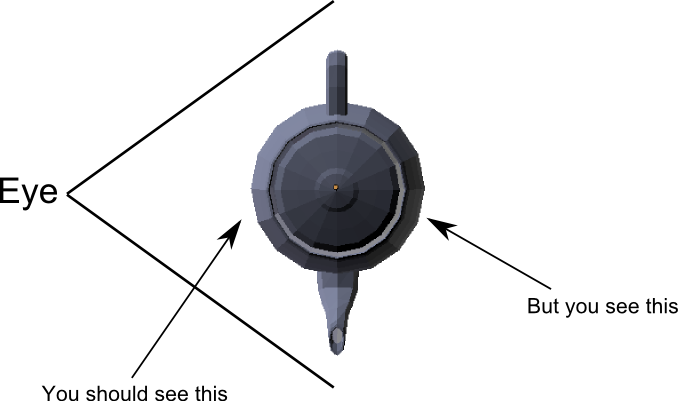

# Depth testing

What's wrong with the teapot of the previous section?


The problem is that faces that are in the back of the model are displayed *above* faces that are
in the front of the model.



This may seem like a stupid problem, but GPUs are nothing more than computers and computers only
do what you tell them to do.

More precisely, what happens is that triangles are drawn one over another in the order in which
they are specified. The last vertices of the list will thus always be in the front.

## Using the depth value

Two sections ago, we saw what the value of `gl_Position` means. The third value of this variable
contains the depth of the vertex on the screen. The larger the value, the further away from the
screen the vertex is.

For the moment this value is simply discarded by the GPU, but now we are going to ask it to use
this value to determine which pixel should be visible.

This functionality adds a step to the rendering pipeline. After the fragment shader has been
called, the GPU will then take the depth value of this fragment (interpolated from the depth of
the surrounding vertices) and compare it with the depth of the pixel that is already on the
screen. If the depth is inferior to the existing value, the pixel is written and the depth value
updated. If this is not the case, the pixel is discarded.

Thanks to this method, when multiple pixels overlap only the pixel whose depth value is the
smallest will remain. This also means that you can draw multiple objects (multiple teapots
for example) without having to care about the order in which you draw them.

## The code

We need to change three things:

 - At initialization, we need to ask glutin to create a depth buffer that will contain
   the depth value of each pixel.
 - Before each frame, we have to reset the content of the depth buffer to `1.0` (which is
   the maximal value). This is similar to when we reset the color to blue.
 - We have to pass additional parameters when drawing to ask the GPU to do this depth test.

The first step consists in changing the context building code:

```rust
let cb = glutin::ContextBuilder::new().with_depth_buffer(24);
```

We ask for the system to allocate a 24 bits depth buffer. 24 bits is a very common value that
is used very frequently. Depth testing is a critical feature of any rendering system, so depth
buffers should be supported everywhere.

For the second step, we need to change this line:

```rust
target.clear_color(0.0, 0.0, 1.0, 1.0);
```

Into this one:

```rust
target.clear_color_and_depth((0.0, 0.0, 1.0, 1.0), 1.0);
```

This asks the backend to fill the depth buffer with the value of `1.0`. Note that this is a
*logical* value, and only the range from `0.0` to `1.0` is valid. The actual content of the buffer
is the maximal representable number. For a 24 bits depth buffer, this is `16777215`.

The third step consists in passing an additional parameter when drawing. The depth test and depth
buffer handling is done directly by the hardware and not by our shader. Therefore we need to
tell the backend what it should do amongst a list of possible operations.

```rust
let params = glium::DrawParameters {
    depth: glium::Depth {
        test: glium::draw_parameters::DepthTest::IfLess,
        write: true,
        .. Default::default()
    },
    .. Default::default()
};

target.draw((&positions, &normals), &indices, &program,
            &uniform! { matrix: matrix, u_light: light }, &params).unwrap();
```

The `test` parameter indicates that pixels should be only be kept if their depth value is inferior
to the existing depth value in the depth buffer. The `write` parameter indicates that the depth
value of the pixels that pass the test should be written to the depth buffer. If we don't set
`write` to true, the content of the depth buffer will always stay at `1.0`.

The `Depth` structure has two other members which we are not going to cover here. Similarly the
`DrawParameters` structure has a lot of members that describe various parts of the rendering
process. This structure will be used a lot in the future.

And here is the result:


If you use an OpenGL debugger, you can see the content of the depth buffer where values are
represented as shades of gray. Here is our depth buffer after drawing the teapot:


**[You can find the entire source code here](https://github.com/glium/glium/blob/master/examples/tutorial-09.rs).**
