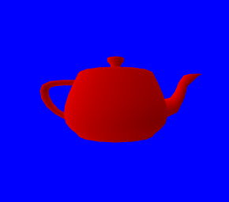

# The perspective

The matrix that we pass to the shader when drawing our teapot contains the position, rotation
and scale of our teapot model. The third row of the fourth column, for example, holds the z
coordinate of the object. If we change it to `0.5` it will increase the z position of the
object by `0.5`.

```rust
let matrix = [
    [0.01, 0.0, 0.0, 0.0],
    [0.0, 0.01, 0.0, 0.0],
    [0.0, 0.0, 0.01, 0.0],
    [0.0, 0.0, 0.5, 1.0f32]
];
```

*Note: this is really the third row of the fourth column. Matrices are stored in column-major
order, meaning that we store the first column, then the second column, then the third column,
then the fourth column.*

...except that there is absolutely no change and our model is still in the same position. This
works, however, if you change the x or y coordinate.

The reason why changing the depth of the object has no effect is that our scene doesn't have
any perspective! The depth is only used in conjunction with the depth buffer (see previous
section) and that's it. In the real life, the further an object is from the eye the smaller it
should appear.

## Correcting the perspective

In order to make objects further away look smaller, the solution is simple: divide the x and y
coordinates by the z coordinate (multiplied by a constant). Since the coordinate `(0, 0)` is
at the center of the screen, objects that are far away will look like they are more towards
the center of the screen, which is the [vanishing point](https://en.wikipedia.org/wiki/Vanishing_point).

But it is not possible with simple matrix multiplications to divide x and y by z. This is where
the fourth coordinate of `gl_Position` comes into play! Instead of dividing x and y, we are
going to put the factor in the `w` coordinate. After the vertex shader is executed, the first
three coordinates will be divided by `w`.

Don't worry if this seem confusing. The most important thing to remember is that this fourth
coordinate exists to serve as a mathematical trick for perspective correction.

## Aspect ratio

Another thing that you may have noticed is that our teapot will stretch to fill the whole window.
This is normal since the coordinates `-1` to `1` correspond to the borders of the window.

However in video games the scene is not stretched. Instead if you resize the window you will
notice that you will see a larger or smaller part of the scene.

To fix this we need to multiply the x coordinate by the height/width ratio of the screen.
We compress the objects of our scene so that when they are stretched out to match the window's
dimensions they get back to their original aspect.

## Introducing the perspective matrix

The reason why these two problems are in the same tutorial is because graphics engines usually
solve both with one matrix: the **perspective matrix**.

```rust
let perspective = {
    let (width, height) = target.get_dimensions();
    let aspect_ratio = height as f32 / width as f32;

    let fov: f32 = 3.141592 / 3.0;
    let zfar = 1024.0;
    let znear = 0.1;

    let f = 1.0 / (fov / 2.0).tan();

    [
        [f *   aspect_ratio   ,    0.0,              0.0              ,   0.0],
        [         0.0         ,     f ,              0.0              ,   0.0],
        [         0.0         ,    0.0,  (zfar+znear)/(zfar-znear)    ,   1.0],
        [         0.0         ,    0.0, -(2.0*zfar*znear)/(zfar-znear),   0.0],
    ]
};
```

*Note: there are actually two different conventions: left-handed and right-handed.
For this tutorial we are using the left-handed because it doesn't invert the z coordinate.*

There are four parameters used when building the matrix:

 - The aspect ratio, which is `height / width`.
 - The *field of view* (or *fov*), which is the angle of the camera. If you have played
   first person shooters, you probably know about this. There is no "right" value as it
   depends on the user's preferences and setup. If you play on a computer you usually
   need a higher fov than if you play on a television.
 - `znear` and `zfar` are the minimal and maximal depth values that are within the
   player's field of view. These values do not impact the visual aspect of the scene
   but they can be important for the precision of the depth buffer.

Don't worry if you don't understand precisely what is going on. This matrix is required to
make the scene look realistic.

Since we don't want to multiply our normals by our perspective matrix, we are going to
use two different matrices: the regular matrix containing the regular transformations
of our object, and the perspective matrix.

```glsl
#version 140

in vec3 position;
in vec3 normal;

out vec3 v_normal;

uniform mat4 perspective;       // new
uniform mat4 matrix;

void main() {
    v_normal = transpose(inverse(mat3(matrix))) * normal;
    gl_Position = perspective * matrix * vec4(position, 1.0);       // new
}
```

Don't forget to pass the additional uniform:

```rust
target.draw((&positions, &normals), &indices, &program,
            &uniform! { matrix: matrix, perspective: perspective, u_light: light },
            &params).unwrap();
```

The scene now has a correct perspective calculation! We can now move the teapot between
any value between `znear` and `zfar`. For example `2.0`:

```rust
let matrix = [
    [0.01, 0.0, 0.0, 0.0],
    [0.0, 0.01, 0.0, 0.0],
    [0.0, 0.0, 0.01, 0.0],
    [0.0, 0.0, 2.0, 1.0f32]
];
```

And here is the result:



Also note that the object keeps its regular look even when we resize the dimension and is no
longer stretched.

If you compare this to the previous screenshot, you can also see how the teapot now looks
much better.

**[You can find the entire source code here](https://github.com/glium/glium/blob/master/examples/tutorial-10.rs).**
