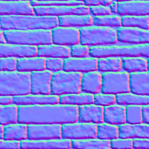

# A textured wall

For this next section, we are going to discard the teapot and draw a wall instead.

## The wall

Since this is a pretty simple shape, we can build it ourselves:

```rust
#[derive(Copy, Clone)]
struct Vertex {
    position: [f32; 3],
    normal: [f32; 3],
}

implement_vertex!(Vertex, position, normal);

let shape = glium::vertex::VertexBuffer::new(&display, &[
        Vertex { position: [-1.0,  1.0, 0.0], normal: [0.0, 0.0, -1.0] },
        Vertex { position: [ 1.0,  1.0, 0.0], normal: [0.0, 0.0, -1.0] },
        Vertex { position: [-1.0, -1.0, 0.0], normal: [0.0, 0.0, -1.0] },
        Vertex { position: [ 1.0, -1.0, 0.0], normal: [0.0, 0.0, -1.0] },
    ]).unwrap();
```

We only have four vertices. The reason is that we are going to use a triangle strip. With
a triangle strip, the GPU will draw one triangle with vertices 0, 1 and 2, and another
triangle with vertices 1, 2, and 3. A triangle strip is very useful when drawing rectangles
or rectangular shapes.

```rust
target.draw(&shape, glium::index::NoIndices(glium::index::PrimitiveType::TriangleStrip), &program,
            &uniform! { model: model, view: view, perspective: perspective, u_light: light },
            &params).unwrap();
```

The rest of the code is mostly the same as before. You should know by now how to draw something!


## Applying a texture

To apply a texture, we do exactly the same thing as a few sections earlier:

 - We load the texture at initialization.
 - We add a `tex_coords` attribute to the vertices.
 - We pass the texture as a uniform.
 - We get the ambient and diffuse colors from the texture.

Loading the texture is done like we have already done before:

```rust
let image = image::load(Cursor::new(&include_bytes!("../book/tuto-14-diffuse.jpg")),
                        image::JPEG).unwrap().to_rgba8();
let image_dimensions = image.dimensions();
let image = glium::texture::RawImage2d::from_raw_rgba_reversed(&image.into_raw(), image_dimensions);
let diffuse_texture = glium::texture::Texture2d::new(&display, image).unwrap();
```

Adding the texture coordinates is also very easy:

```rust
#[derive(Copy, Clone)]
struct Vertex {
    position: [f32; 3],
    normal: [f32; 3],
    tex_coords: [f32; 2],
}

implement_vertex!(Vertex, position, normal, tex_coords);
```

Passing the texture involves adding a new uniform in our fragment shader:

```glsl
uniform sampler2D diffuse_tex;
```

And passing it when drawing:

```rust
target.draw(&shape, glium::index::NoIndices(glium::index::PrimitiveType::TriangleStrip), &program,
            &uniform! { model: model, view: view, perspective: perspective,
                        u_light: light, diffuse_tex: &diffuse_texture },
            &params).unwrap();
```

And then in the fragment shader, we load the diffuse and ambient colors from the texture instead.

We just replace this:

```glsl
const vec3 ambient_color = vec3(0.2, 0.0, 0.0);
const vec3 diffuse_color = vec3(0.6, 0.0, 0.0);
```

With this:

```glsl
vec3 diffuse_color = texture(diffuse_tex, v_tex_coords).rgb;
vec3 ambient_color = diffuse_color * 0.1;
```

And we should get a textured wall!


## Normal mapping

However the outcome is not great. You can clearly see that it's just a rectangle with a wall
drawn on it and not an actual wall.

There is a technique that can greatly improve the quality of the rendering: normal mapping.

The problem with our current rendering is that the light doesn't penetrate between the rocks.
If each individual stone was drawn one by one the rendering would be much better thanks to
lighting.

Normal mapping consists in adjusting the lighting calculation of our rectangle in order to do
as if there were individual stones in there. This is done by providing a normal *per-fragment*.
If you remember, a normal is a vector perpendicular to the surface at a location. By using
more fine-grained normals, we can also make the user believe that the surface itself is
fine-grained.

Here is what a *normal map* is:



As you can see there are a lot of similarities with the regular texture. Each pixel of the normal
map represents the value of the normal at this pixel's location. Instead of storing colors we
store arbitrary values that represent the normal. For example normal maps are often blue because
blue is the value `(0.0, 0.0, 1.0)` which is a vector pointing to the outside.

Let's start with the beginning. We load the normal map into a texture:

```rust
let image = image::load(Cursor::new(&include_bytes!("../book/tuto-14-normal.png")),
                        image::PNG).unwrap().to_rgba8();
let image_dimensions = image.dimensions();
let image = glium::texture::RawImage2d::from_raw_rgba_reversed(&image.into_raw(), image_dimensions);
let normal_map = glium::texture::Texture2d::new(&display, image).unwrap();
```

And we add a new uniform in our fragment shader:

```glsl
uniform sampler2D normal_tex;
```

Now instead of using the value of `v_normal` that comes from our vertex shader, we are going to
load the normal from the normal map, similarly to how we load the diffuse color from the diffuse
texture.

```glsl
vec3 normal_map = texture(normal_tex, v_tex_coords).rgb;
```

However there is a problem. The value stored in the normal map contains the normal vectors
relative to the surface of the object. But during our calculations we are in scene coordinates
relative to the camera. We need to multiply the value we load from the normal map by a matrix
in order to get usable values. This matrix is called the **TBN** matrix (for
*Tangent Binormal Normal*).

In the past, some of the calculations required for this matrix were precomputed and passed
as attributes. But calculating this on the fly is really practical. Here is a function from
[http://www.thetenthplanet.de/archives/1180](http://www.thetenthplanet.de/archives/1180) that
calculates it:

```glsl
mat3 cotangent_frame(vec3 normal, vec3 pos, vec2 uv) {
    vec3 dp1 = dFdx(pos);
    vec3 dp2 = dFdy(pos);
    vec2 duv1 = dFdx(uv);
    vec2 duv2 = dFdy(uv);

    vec3 dp2perp = cross(dp2, normal);
    vec3 dp1perp = cross(normal, dp1);
    vec3 T = dp2perp * duv1.x + dp1perp * duv2.x;
    vec3 B = dp2perp * duv1.y + dp1perp * duv2.y;

    float invmax = inversesqrt(max(dot(T, T), dot(B, B)));
    return mat3(T * invmax, B * invmax, normal);
}
```

Thanks to this we can calculate the *real* normal, in other words the normal of the surface
at the given pixel:

```glsl
mat3 tbn = cotangent_frame(v_normal, -v_position, v_tex_coords);
vec3 real_normal = normalize(tbn * -(normal_map * 2.0 - 1.0));
```

The rest of the code is the same as before. We apply phong shading, except that we use
`real_normal` instead of `v_normal`.

And here is the result:


This is much more convincing!

**[You can find the entire source code here](https://github.com/glium/glium/blob/master/examples/tutorial-14.rs).**
