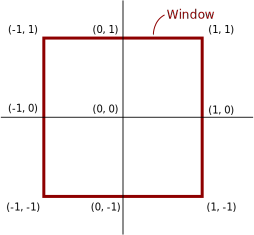
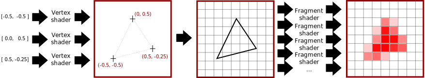

Hello and welcome to the glium tutorials! This serie of tutorials will teach you how to work with OpenGL thanks to the glium library. Glium's API uses the exact same concepts as OpenGL and has been designed to remove the burden of using raw OpenGL funtion calls, which are often non-portable, tedious and error-prone. Even if for some reason you don't plan on using the glium library in the future, these tutorials can still be useful as they will teach you how OpenGL and graphics programming in general work.

If at any moment you encounter an error, please open an issue. Everything related to the window, fullscreen mode, or events is handled by [glutin](https://github.com/tomaka/glutin/issues), while everything related to rendering is handled by [glium](https://github.com/tomaka/glium/issues).

### Creating a project

To start this tutorial, we will create a new project from scratch. Even though it's highly recommended to be familiar with Rust and Cargo before starting, some little reminders are always good. Let's start by running:

    cargo new --bin my_project
    cd my_project

The directory you have just created should contain a `Cargo.toml` file which contains our project's metadata, plus a `src/main.rs` file which contains the Rust source code. If you have `src/lib.rs` file instead, that means that you forgot the `--bin` flag ; just rename the file.

In order to use the glium library, we need to add them as dependencies in our `Cargo.toml` file:

    [dependencies]
    glium = "*"

Before we can use them, we also need to import this library in our `src/main.rs` file, like this:

    #[macro_use]
    extern crate glium;

    fn main() {
    }

It is now time to start filling the `main` function!

### Creating a window

The first step when creating a graphical application is to create a window. If you have ever worked with OpenGL before, you know how hard it is to do this correctly. Both window creation and context creation are platform-specific, and they are sometimes weird and tedious. Fortunately, this is where the **glutin** library shines.

Initializing a window with glutin can be done by calling `glium::glutin::WindowBuilder()::new().build().unwrap()`. However we don't want to create a *glutin* window but a *glium* window. Instead of calling `build()` we going to call `build_glium()`, which is defined in the `glium::DisplayBuild` trait.

    fn main() {
        use glium::DisplayBuild;
        let display = glium::glutin::WindowBuilder::new().build_glium().unwrap();
    }

But there is a problem: as soon as the window has been created, our main function exits and `display`'s destructor closes the window. To prevent this, we are just going to add an infinite loop until we detect that the window has been closed:

    loop {
        if display.is_closed() {
            break;
        }
    }

This is a bad practice as it will consume 100% of our CPU, but that will do for now.

You can now execute `cargo run`. After a few minutes during which Cargo downloads and compiles glium and its dependencies, you should see a nice little window.

### Clearing the color

The content of the window, however, is not not very appealing. Depending on your system, it can appear black, show a random image, or just some snow. We are expected to draw on the window, so the system doesn't bother initializing its color to a specific value.

Glium and the OpenGL API work similarly to a drawing software like Window's Paint or The GIMP. We start with an empty image, then draw an object on it, then another object, then another object, etc. until we are satisfied with the result. But contrary to a drawing software, you don't want your users to see the intermediate steps. Only the final result should be shown.

To handle this, OpenGL uses what is called *double buffering*. Instead of drawing directly to the window, we are drawing to an image stored in memory. Once we have finished drawing, this image is copied to the window.
This is represented in glium by the `Frame` object. When you want to start drawing something on your window, you must first call `display.draw()` in order to produce a `Frame`:

    let mut target = display.draw();

We can then use this `target` as a drawing surface. One of the operation that OpenGL and glium provide is filling the surface with a given color. This is what we are going to do.

    target.clear_color(0.0, 0.0, 1.0, 1.0);

Note that to use this function, we will need to import the `Surface` trait first:

    use glium::Surface;

The four values that we pass to `clear_color` represent the four components of our color: red, green, blue and alpha. Only values between `0.0` and `1.0` are valid. Here we are drawing an opaque blue color.

Like I explained above, the user doesn't immediatly see the blue color on the screen. At this point if we were in a real application, we would most likely draw our characters, their weapons, the ground, the sky, etc. But in this tutorial we will just stop here:

    target.finish();

This call to `finish()` means that we have finished drawing. It destroys the `Frame` object and copies our background image to the window. Our window is now filled with blue.

Here is our full `main` function after this step:

    fn main() {
        use glium::{DisplayBuild, Surface};
        let display = glium::glutin::WindowBuilder::new().build_glium().unwrap();

        loop {
            let mut target = display.draw();
            target.clear_color(0.0, 0.0, 1.0, 1.0);
            target.finish();

            if display.is_closed() {
                break;
            }
        }
    }

### Drawing a triangle

The next part of this tutorial will cover drawing a triangle on our surface.

With some exceptions (like the clearing operation that was used above), OpenGL doesn't provide any function to easily draw shapes. There is no `draw_rectangle`, `draw_cube` or `draw_text` function for example. Instead everything is handled the same way: through the graphics pipeline. It doesn't matter whether you draw a simple triangle or a 3D model with thousands of polygons and advanced shadowing techniques, everything uses the same mechanics.

This is the point where the learning curve becomes very steep, as you need to learn how the graphics pipeline works even if you just want to draw a single triangle. However once you have passed that step, it will become easier to understand the rest.

Before we can draw a triangle, we need to prepare two things during the initialization:

 - A shape that describes our triangle.
 - A program that will be executed by the GPU.

#### Shape

A shape represents the geometry of an object. When you think "geometry", you may think of squares, circles, etc., but in graphics programming the only shapes that we are going to manipulate are triangles (note: tessellation unlocks the possibility to use other polygons, but this is an advanced topic).

Here is an example of an object's shape. As you can see, it is made of hundreds of triangles and only triangles.

Each triangle is made of three vertices, which means that a shape is just a collection of vertices linked together to form triangles. The first step to describe a shape like this with glium is to create a struct named `Vertex` (the actual name doesn't matter) whose purpose is to describe each individual vertex. Our collection of vertices can later be represented by a `Vec<Vertex>`.

    #[derive(Copy, Clone)]
    struct Vertex {
        position: [f32; 2],
    }

    implement_vertex!(Vertex, position);

Our struct contains a `position` field which we will use to store the position of each vertex on the window. Being a true vectorial renderer, OpenGL doesn't use coordinates in pixels. Instead it considers that the window has a width and a height of 2 units, and that the origin is at the center of the window.

When we give positions to OpenGL, we need to use this coordinate system. Let's pick a shape for our triangle, for example this one:

Which translates into this code:

    let vertex1 = Vertex { position: [-0.5, -0.5] };
    let vertex2 = Vertex { position: [ 0.0,  0.5] };
    let vertex3 = Vertex { position: [ 0.5, -0.25] };
    let shape = vec![vertex1, vertex2, vertex3];

We now have our shape! There is a last step which consists in uploading this shape to the memory of our video card in what is called a *vertex buffer*, for faster access. Even though that is not strictly necessary, it is very easy to do so and it will make our draw operation considerably faster.

    let vertex_buffer = glium::VertexBuffer::new(&display, shape);

More complex shapes consist of hundred or thousands of vertices. We not only need to have a list of vertices, but also a way to tell OpenGL how to link these vertices together to obtain triangles. Since we only have one triangle, this isn't really relevant for us, so we just create a dummy marker that we will pass to glium later on.

    let indices = glium::index::NoIndices(glium::index::PrimitiveType::TrianglesList);

#### Program

When OpenGL was first created in the 1990s, drawing an object simply consisted in sending a shape alongside with various parameters like the color, lightning direction, fog distance, etc. But these parameters quickly became too limitating for game creators, and when OpenGL 2 was released a more flexible system was added with what are called *shaders*. When OpenGL 3 was released a few years later, all these parameters were removed and totally replaced by shaders.

In order to draw a triangle, you will need some basic understanding about how the drawing processus (also called the *pipeline*) works.

The list of coordinates at the left of the schema represents the vertices of the shape that we have created earlier. When we will ask the GPU to draw this shape, it will first execute what is called a *vertex shader*, once for each vertex (that means three times here). A vertex shader is a small program whose purpose is to tell the GPU what the screen coordinates of each vertex is. Then the GPU builds our triangle and determines which pixels of the screen are inside of it. It will then execute a *fragment shader* once for each of these pixels. A fragment shader is a small program whose purpose is to tell the GPU what the color of each pixel needs to be.

The tricky part is that *we* need to write the vertex and fragment shaders. To do so, we have to write it using a programming language named *GLSL*, which is very similar to the C programming language. Teaching you GLSL would be a bit too complicated for now, so I will just give you the source codes. Here is the source code that we will use for the vertex shader:

    let vertex_shader_src = r#"
        #version 140

        in vec2 position;

        void main() {
            gl_Position = vec4(position, 0.0, 1.0);
        }
    "#;

First of all, the `#version 140` line is here to tell OpenGL what version of GLSL this source code corresponds to. Some hardware don't support the latest versions of GLSL, so we are trying to stick to earlier versions if possible.

When we defined the `Vertex` struct in our shape, we created a field named `position` which contains the position of our vertex. But contrary to what I let you think, this struct doesn't contain the actual position of the vertex but only a attribute whose value is passed to the vertex shader. OpenGL doesn't care about the name of the attribute, all it does is passing its value to the vertex shader. The `in vec2 position;` line of our shader is here to declare that we are expected to be passed an attribute named `position` whose type is `vec2` (which corresponds to `[f32; 2]` in Rust).

The `main` function of our shader is called once per vertex, which means three times for our triangle. The first time, the value of `position` will be `[-0.5, -0.5]`, the second time it will be `[0, 0.5]`, and the third time `[0.5, -0.25]`. It is in this function that we actually tell OpenGL what the position of our vertex is, thanks to the `gl_Position = vec4(position, 0.0, 1.0);` line. We need to do a small conversion because OpenGL doesn't expect two-dimensional coordinates, but *four*-dimensional coordinates (the reason for this will be covered in a later tutorial).

The second shader is called the fragment shader (sometimes also named *pixel shader*).

    let fragment_shader_src = r#"
        #version 140

        out vec4 color;

        void main() {
            color = vec4(1.0, 0.0, 0.0, 1.0);
        }
    "#;

This source code is very similar to our vertex shader above. This time the `main` function is executed once per pixel and has to return the color of this pixel, which we do with the `color = vec4(1.0, 0.0, 0.0, 1.0);` line. Just like with `clear_color` earlier, we need to pass the red, green, blue and alpha components of the pixel. Here we are returning an opaque red color. It is possible to return different values depending on the pixel, but this will be covered in the next tutorials.

Now that we have written our shaders' source codes, let's send them to the glium library:

    let program = glium::Program::from_source(&display, vertex_shader_src, fragment_shader_src, None).unwrap();

#### Drawing

Now that we have prepared our shape and program, we can finally draw this triangle!

Remember the `target` object? We will need to use it to start a draw operation.

    let mut target = display.draw();
    target.clear_color(0.0, 0.0, 1.0, 1.0);
    // draw the triangle here
    target.finish();

Starting a draw operation needs several things: a source of vertices (here we use our `vertex_buffer`), a source of indices (we use our `indices` variable), a program, the program's uniforms, and some draw parameters. We will explain what uniforms and draw parameters are in the next tutorials, but for the moment we will just ignore them by passing a `EmptyUniforms` marker and by building the default draw parameters.

    target.draw(&vertex_buffer, &indices, &program, &glium::uniforms::EmptyUniforms,
                &std::default::Default::default()).unwrap();

The "draw command" designation could make you think that drawing is a heavy operation that takes a lot of time. In reality drawing a triangle takes less than a few microseconds, and if everything goes well you should see a nice little triangle:

[Click here for the second tutorial](02-animating-triangle.html)

### Final source code

Here is the final code of our `src/main.rs` file:

    #[macro_use]
    extern crate glium;

    fn main() {
        use glium::{DisplayBuild, Surface};
        let display = glium::glutin::WindowBuilder::new().build_glium().unwrap();

        #[derive(Copy, Clone)]
        struct Vertex {
            position: [f32; 2],
        }

        implement_vertex!(Vertex, position);

        let vertex1 = Vertex { position: [-0.5, -0.5] };
        let vertex2 = Vertex { position: [ 0.0,  0.5] };
        let vertex3 = Vertex { position: [ 0.5, -0.25] };
        let shape = vec![vertex1, vertex2, vertex3];

        let vertex_buffer = glium::VertexBuffer::new(&display, shape);
        let indices = glium::index::NoIndices(glium::index::PrimitiveType::TrianglesList);

        let vertex_shader_src = r#"
            #version 140

            in vec2 position;

            void main() {
                gl_Position = vec4(position, 0.0, 1.0);
            }
        "#;

        let fragment_shader_src = r#"
            #version 140

            out vec4 color;

            void main() {
                color = vec4(1.0, 0.0, 0.0, 1.0);
            }
        "#;

        let program = glium::Program::from_source(&display, vertex_shader_src, fragment_shader_src, None).unwrap();

        loop {
            let mut target = display.draw();
            target.clear_color(0.0, 0.0, 1.0, 1.0);
            target.draw(&vertex_buffer, &indices, &program, &glium::uniforms::EmptyUniforms,
                        &std::default::Default::default()).unwrap();
            target.finish();

            if display.is_closed() {
                break;
            }
        }
    }
